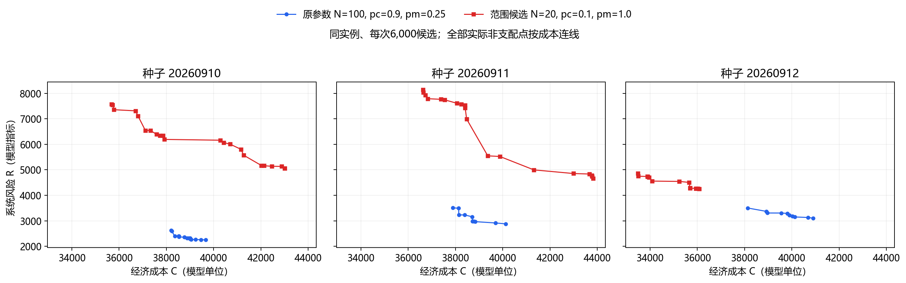

# 范围优先调参：阶段结论

只调参数；保留原 NSGA-II 算法结构及全部失败结果。正式文稿、PPO和历史档案不覆盖。

## 三次同预算配对

| 配置 | 平均成本跨度 | 平均风险跨度 | 平均HV | 平均最小J |
|---|---:|---:|---:|---:|
| 原参数：100 / 0.9 / 0.25 | 2156.33 | 469.17 | 0.33460 | 0.46760 |
| 范围候选：20 / 0.1 / 1.0 | 5709.29 | 2206.12 | 0.32558 | 0.53553 |

均为6,000候选。成本/风险平均跨度为原参数的 2.65/4.70 倍；HV变化 -2.70%，最小J均值变化 +14.53%。三个种子中 2/3 的两轴跨度同时超过原参数。

| 种子 | 成本跨度倍数 | 风险跨度倍数 | 新点数 |
|---|---:|---:|---:|
| 20260910 | 5.00 | 6.61 | 22 |
| 20260911 | 3.22 | 5.57 | 19 |
| 20260912 | 0.94 | 1.54 | 14 |

连线仅作视觉引导，不表示线段中间点都是可行解。所有点保留，不做平滑、平均或跨重复合并。

## 修改边界与失败方向

候选仍使用原初始化概率0.5，只将N=100改20、pc=.9改.1、pm=.25改1。pm=1是每个子代一次单分量变异尝试，不是每个基因都变异。低交叉率使搜索更依赖变异，但排序、拥挤距离、锦标赛、精英保留、解码和修复都未改变。

另试过初始化服务概率.8/.95：仅改变原Bernoulli参数，原生成流程不变，相关运行的实际概率如下；它们没有混入上述三次候选结果。

| 初始化试验 | 种子 | 非末周期服务概率 |
|---|---:|---:|
| init80 | 20260910 | 0.8 |
| init80_m50 | 20260910 | 0.8 |
| init80_n200 | 20260910 | 0.8 |
| init95 | 20260910 | 0.95 |
| init95 | 20260911 | 0.95 |
| init95 | 20260912 | 0.95 |

完整参数表及不利结果见 [results.md](results.md)。初筛变异率.5曾出现成本跨度5128，但其他种子缩小，6000候选后首种子缩至406，未将其作为可靠成功。

审核：42份档案（其中3份原参数6000结果逐字节复用），389份去重方案通过完整原MILP核验。

单实例反复试参，只是探索性结果；质量允许下降并不意味着被支配方案可补回前沿。本轮未证明在原40320/120960预算下仍有同样范围，也不是对真实完整Pareto前沿的证明。
