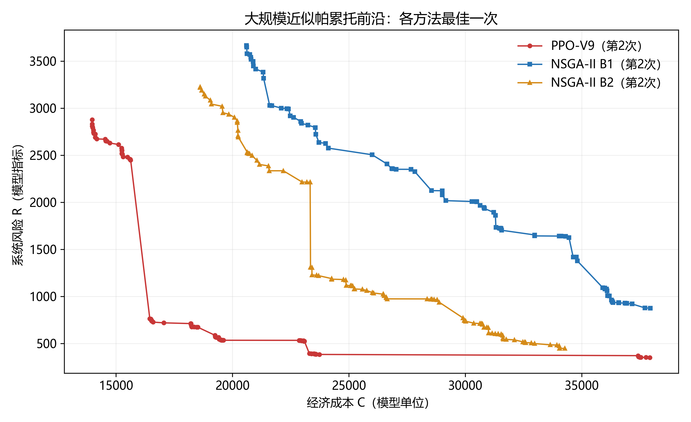
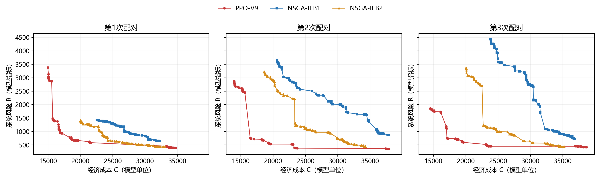
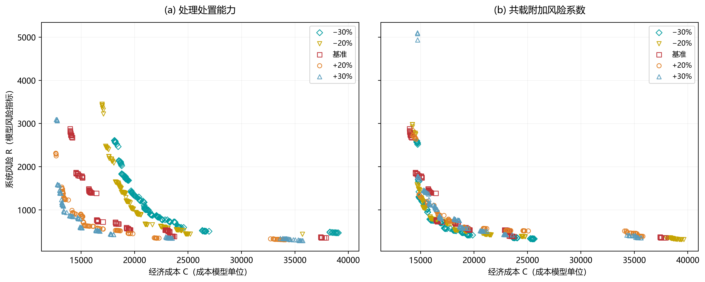
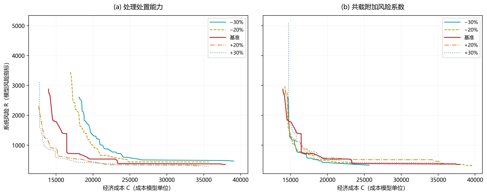
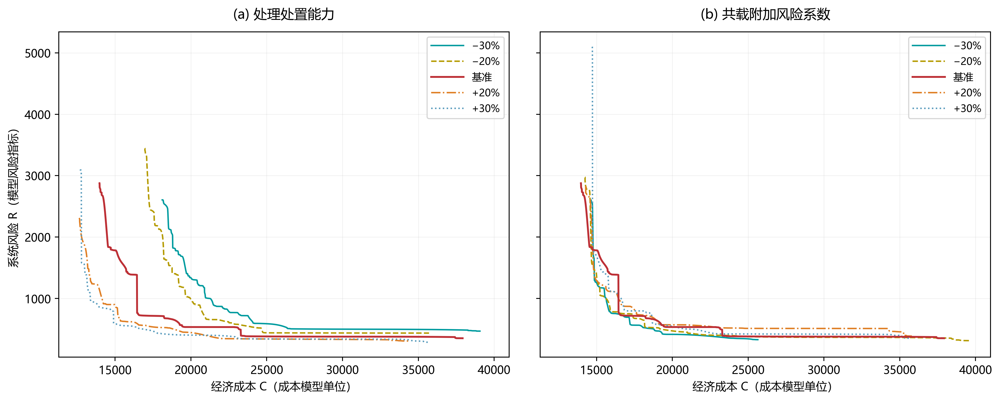

# 四、数值实验与结果分析

本节依次开展固定偏好下的小规模质量验证、大规模近似帕累托前沿比较、冻结模型跨规模案例测试和关键参数敏感性分析。本次沿用原五个基础案例及八个敏感性版本、固定b、V9冻结模型及已完成的v11 PPO结果，仅按指定红线参数重新计算全部NSGA-II基线；MILP继续复用v9已完成记录，不新增训练、PPO或MILP求解。所有重复均为同一实例上的算法随机重复，不是独立实例样本。历史NSGA-II档案另存，不与新基线拼接。

## （一）实验设置与共同评价口径

### 1. 实例、模型与归一化

小规模质量验证的规模为3/2/2/3/2（依次为产废节点、废物品类、处理处置设施、车辆及周期），来源实例生成种子为3723524230，新版实例为`legacy-small-fixed--revision-v4`。参考方案沿用v4时已完成的逐期服务、联合车辆—设施分配及确定性路线排序构造，原分配器种子为0；本轮只校验保存的方案和b，未重新构造或定标。原参考种子作为历史来源信息保留，不冒充本轮新构造的随机种子。四个跨规模测试案例分别为Test-1（3/2/2/3/2）、Test-2（6/2/2/4/3）、Test-3（10/3/3/5/3）和Test-4（20/4/3/8/4），均读取已锁定测试库的000号新版实例。小规模质量验证案例与Test-1虽具有相同规模，但实例身份不同。大规模主实验L20及敏感性分析共用Test-4基础实例。

Train-S与Train-L分别对应v9阶段训练并冻结的New-S-v9、New-L-v9。两模型在v9阶段分别使用原v4对应规模的24个训练实例从头训练，采用v8优化后的全对象PPO结构，并按预先固定的21偏好episode分配覆盖整张偏好网格。每实例只分配1至3个偏好，不声称每实例均见齐21偏好。训练结束仅保存预定最终检查点，随后冻结推理；旧模型、训练库与结果保留。v8结构曾依据固定Test-4反馈调整，本轮不重训，沿用模型同样不抹去这种测试知情设计。每个实例在准备阶段与一份严格可行参考方案绑定，固定正值`b_C`、`b_R`，目标为

$$
J_{\omega,i}(x)=\omega_c\frac{C_i(x)}{b_{C,i}}+\omega_r\frac{R_i(x)}{b_{R,i}},\qquad\omega_c+\omega_r=1.
$$

PPO的目标输入、奖励规则及冻结搜索的加权择优均读取目标实例自身的同一组b，不使用1000/100旧编码，不随偏好、重复或当前解重新定标。测试b无需等于训练b。各算法针对同一实例和数学约束，保存方案在本轮报告重建时统一由当前共同评价器重放；PPO和NSGA-II共享公共参考起点，MILP仅共享实例及固定b，未声明使用该起点暖启动。NSGA-II按原始成本C和风险R搜索双目标。敏感性版本分别在自身参数下预先绑定b，跨版本只比较原始C、R及实际方案，不以不同b下的J排序。

本次NSGA-II搜索与保存方案复核使用当前共同评价器（SHA256 `0e987e27da0e77be61530e9b71b536966c5da3f9648f9786fa62b6901eaab79f`），包含BG/BD服务前总容量检查；PPO沿用v11同一评价口径的已完成档案。旧v4 NSGA-II记录仅作为历史来源保留，不作为表5、表6的新基线。本次新NSGA-II档案及参与覆盖比较的PPO方案均需重新通过完整原MILP矩阵、变量界与整数性审核；PASS以当前文件哈希为准。

新版处理能力的口径为：每类废物在每个周期内，对技术匹配设施的有效能力求和，合计等于该类全系统平均单周期产量的2倍，匹配设施之间等额分配；技术不匹配的名义容量不计入有效合计。兼容异类对各自按固定种子独立抽取附加强度κ∼U(2,5)，共载系数为κ(h_s+h_t)/2，其中h_s、h_t为废物后果系数。只有在同一弧段、两类等正载量的条件下，基础运输风险加额外共载风险与无共载附加项的运输风险之比为1+κ∼U(3,6)，不将最大一对强制校准到5倍，也不意味着整个系统风险放大相同倍数。Test-4实际兼容异类对的这一比值范围为3.2443—5.6250。此区间是按本轮要求设置的合成压力情景，不是化学反应或企业数据标定系数。

### 2. 搜索预算、档案与统计

小规模设置五组偏好，每组PPO独立求解3次，各次上限12000个候选动作，取最小J实际方案。其他PPO实验的一次完整前沿包含21组偏好(k/20,1−k/20)，k=0,…,20；每偏好均从同一公共起点出发，上限12000次尝试，每批8个候选，满额相当于1500批，完整前沿上限252000次。采用温度2、输入进度horizon=1024和同状态完整动作去重，按用户要求，将原每偏好1920上限提高至12000；PPO完整前沿预算为NSGA-II B1的6.25倍、B2的约2.0833倍，不是等候选预算对照。状态输入改变即清空去重记录；仍按PPO剩余联合概率抽样，不用启发式代选对象。正概率动作集合真实耗尽时允许提前停止，不补虚构次数、不将剩余名额转移给其他偏好。外部档案保存初始方案及全部实际生成且严格可行的非支配候选，而不只保留21个末次方案；档案不反馈搜索。

本次NSGA-II采用范围优先探索确定的参数：种群20、交叉率0.10、个体变异率1.00，随机初始化的非末周期服务概率仍为0.50。个体变异率1表示每个子代一次单分量变异尝试，并非所有基因都变异。非支配等级—拥挤度二元锦标赛、父子代精英选择、编码、解码及确定性修复均未改变；较低交叉率使搜索更依赖变异，但不更换算法框架。每个“收运实体—周期”的基因表达服务开关、车辆、设施偏好和访问顺序，末期必访，前期服务可变。外部非支配档案仅用于记录，不反馈搜索。四个规模各3次运行至B1=40320候选尝试，Test-4同次继续至B2=120960；初始化新增19个个体、重复和修复失败均计数，半代已评价的可行候选仍纳入档案。参数曾依据Test-4低预算范围反馈选择，因此属于测试知情参数设定；本次正式预算运行前锁定，不在中途调参。

预算参照核验：本地Chen等论文的1000/3000为iterations，不等同于本仓库候选尝试。本次种群20，每个完整子代批为20个候选，初始化新增19个候选；B1/B2仍保持文稿原有40320/120960次尝试，不因种群缩小而缩减总预算。PPO仍复用每偏好12000、完整前沿上限252000的v11档案，分别为B1的6.25倍、B2的约2.0833倍。本轮12次新NSGA-II演化产生15份预算档案；候选尝试、目标评价和墙钟时间是不同投入指标，不声明与参考文献或PPO严格等投入。

主指标采用弱覆盖率，以𝒞区别于经济成本C：

$$
\mathcal{C}(A,B)=\frac{\left|\left\{b\in B:\ \exists a\in A,\ C(a)\leq C(b),\ R(a)\leq R(b)\right\}\right|}{|B|}
$$

其中，集合外的竖线表示集合基数，即点数。分子是在B中被A内至少一个方案弱支配的点数，分母为B的点数；成本和风险均不大于被比较点即计入覆盖，包括相等目标点。判定使用未经展示舍入的`C/b_C`、`R/b_R`，统一容差10⁻⁸。两个档案先分别去重并剔除严格被支配点，不先合并算法解集；目标重合时按稳定方案标识保留代表。每个重复编号配对计算两个方向覆盖率，表内为3次完整前沿配对的均值±运行间样本标准差（ddof=1）。21偏好不构成21个统计样本。

PPO沿用v11的CPU冻结推理及历史计时，原workers配置16、每进程1线程。本次NSGA-II新运行workers=4、每进程1线程；不同批次的资源争用条件不同，时间仅作实际投入记录，不直接声称公平加速倍数。MILP继续复用单线程原始耗时。NSGA-II计时包括搜索、严格候选核验和档案维护，B2从同次搜索起点累计并包含B1快照写盘，不是增量时间；参考方案首次评价、最终预算快照导出和离线审核不计入搜索段，任务总耗时另存。PPO原计时口径不变，模型加载、训练和本次离线报告耗时不追加进旧推理时间。

## （二）小规模固定偏好求解质量验证

新版小规模实例`legacy-small-fixed--revision-v4`绑定b_C=2392.144045、b_R=41.201198965340431。本节仅比较当前冻结Train-S与MILP，不构建完整精确帕累托前沿。MILP每组单次求解，显式时限3600 s、相对gap目标0；原始变量、状态、界和墙钟时间均另存。PPO各偏好沿用已记录的3个原评估种子，模型沿用登记的V9冻结模型，本轮不重新训练。

**表4 小规模固定偏好下PPO-Transformer与MILP的求解结果**

| 方法 | 偏好 (ωc,ωr) | 成本 C | 风险 R | 目标 J | 差异 (%) | 时间 (s) | 状态 |
| --- | --- | --- | --- | --- | --- | --- | --- |
| PPO | (1.0, 0.0) | 1623.806 | 20.6633 | 0.678808 | 2.089 | 3.58 | 严格可行 |
| PPO | (0.75, 0.25) | 1666.733 | 17.9780 | 0.631651 | 6.345 | 3.59 | 严格可行 |
| PPO | (0.5, 0.5) | 1865.047 | 7.3896 | 0.479504 | 1.317 | 3.71 | 严格可行 |
| PPO | (0.25, 0.75) | 2117.281 | 5.7840 | 0.326563 | 0.000 | 3.88 | 严格可行 |
| PPO | (0.0, 1.0) | 2604.135 | 4.4555 | 0.108141 | 0.000 | 3.99 | 严格可行 |
| MILP | (1.0, 0.0) | 1590.583 | 19.6499 | 0.664919 | — | 75.62 | 已证最优 |
| MILP | (0.75, 0.25) | 1646.207 | 12.8277 | 0.593965 | — | 141.11 | 已证最优 |
| MILP | (0.5, 0.5) | 1802.092 | 7.9604 | 0.473273 | — | 211.97 | 已证最优 |
| MILP | (0.25, 0.75) | 2117.281 | 5.7840 | 0.326563 | — | 3258.31 | 已证最优（规范化核验） |
| MILP | (0.0, 1.0) | 2604.135 | 4.4555 | 0.108141 | — | 3165.36 | 已证最优 |

注：表中PPO为PPO-Transformer的简称。PPO每行对应3次运行中J最小的同一个实际方案，成本、风险与J不分别择优；并列按运行编号。PPO时间为3次完整搜索耗时之和。MILP时间为复用v9原运行的单次实际墙钟时间，不含之后离线数值规范化或独立审计；C、R与J来自同一个经验证的实际变量解。相对差异记为Δ_J，单位为%，正值表示PPO目标值高于MILP参照值，计算式为：

$$
\Delta_J(\%)=100\,\frac{J_{\mathrm{PPO}}-J_{\mathrm{MILP}}}{J_{\mathrm{MILP}}}
$$

本轮复用的五组MILP参照均满足声明数值容差内的最优终止与交接判据，表中没有限时可行参照。最优性依据求解器证明及规范化完整约束核验，而非是否接近某个已知目标。

MILP数值交接采用统一离线规范化：对五组返回向量均将距整数不超过10⁻⁵的整数变量舍入，连续变量绝对值小于10⁻⁵时置零，其余连续量不变。1组原始返回解的共同评价与求解器目标在规范化前不一致；整数弧及连续载量的近零容差值可能被评价器的存在性判断放大；原始向量、指标与一致性标志完整保留在[原始MILP记录](../output/pareto-ppo-budget-v11/milp/)中，不用重建路线替代返回解。规范化后的[五组完整变量方案](../output/pareto-ppo-budget-v11/milp/validated/)均重新通过原完整MILP矩阵、变量界、整数性与共同严格可行检查，最大约束残差为7.11e-06，共同评价J与原求解器目标的最大绝对差为1.36e-08。该步骤未新增搜索或提高最优性证明，后处理耗时另存cleanup_seconds，不计入表中求解时间；求解器终止状态、界、gap和3600 s时限均来自原记录；报告最优判定单独保存，不覆盖源文件标志。

最优状态采用独立的报告层交接判定：要求求解器正常最优终止、status=0、success=true、mip_gap=0、原目标与对偶界相符，并要求规范化方案严格可行、共同目标及线性目标与求解器目标一致，原完整矩阵、变量界和整数性残差均不超过10⁻⁵，目标交接容差为10⁻⁷。这里“已证最优”指声明数值容差内的最优终止与交接；规范化J略小于求解器对偶界时，该微小差异属于数值容差，不是找到比已证最优值更优的新解。该判定只接续原有求解器证明，不新增求解或覆盖原始布尔标志。偏好(0.25, 0.75)的原始及规范化记录均保留proven_optimal=false，原始objective_consistent=false；但求解器status=0、success=true、gap=0，原目标与对偶界均为0.32656291494585427，规范化J=0.32656290137123994，两者绝对差为1.36e-08，完整矩阵最大残差为7.11e-06，运行时间为3258.31 s，并非限时终止。这些组在表中标为“已证最优（规范化核验）”，不误标为限时可行。

五组偏好中，MILP在5组完成最优性证明，PPO在这些组中的2组达到相同目标（数值容差内）。纯成本偏好下风险不参与目标，成本相同的不同实际方案可以具有不同风险，表中未用其他方案的较小风险替换MILP返回解；纯风险偏好下成本同样只作为伴随指标报告，不参与该次目标。小规模表使用三次择优结果，不能将其解释为单次平均性能；该投入也必须和三次累计时间一并考虑。

## （三）大规模近似帕累托前沿比较

L20采用Test-4唯一固定案例，PPO使用冻结Train-L的v11已完成结果。每次PPO前沿与同重复编号的新NSGA-II B1、B2配对；NSGA-II沿用原正式实验种子，B2接续同次B1，不是另外独立重启。

**表5 大规模实例下PPO-Transformer与NSGA-II的双向覆盖率**

| 方法 | B1 N→P | B1 P→N | B2 N→P | B2 P→N |
| --- | --- | --- | --- | --- |
| PPO-L vs NSGA-II | 0.0000 ± 0.0000 | 1.0000 ± 0.0000 | 0.0324 ± 0.0374 | 0.8226 ± 0.2375 |

注：B1=40320、B2=120960候选尝试；每格为3次配对的均值±样本标准差。N→P表示𝒞(N,P)，P→N表示𝒞(P,N)，不是成本/风险降低比例。两档各计划3次、有效3次、失败0次；共用相同PPO档案，不增加PPO重启。时间见附录A.2，未舍入覆盖点数和分母见新coverage_pairs.csv。

**图1 大规模PPO与NSGA-II近似帕累托前沿对比**

注：每种方法在3次运行中，按归一化参照点(1.1,1.1)下HV最大选取一次，并列取较小重复编号。各条线均为该次全部实际非支配方案按成本排序连接，不平均坐标、不平滑、不补入被支配点。连线中间位置不代表额外可行解。图为择优展示，表5仍使用全部3次配对，不能用择优图替代平均比较。

本图选择：PPO-V9第2次，99点，成本[13973.63,37924.10]、风险[350.12,2876.46]；NSGA-II B1第2次，82点，成本[20604.51,37947.02]、风险[874.19,3666.57]；NSGA-II B2第2次，100点，成本[18610.79,34277.42]、风险[446.60,3225.52]。

本次B1的N→P/P→N为0.0000 ± 0.0000/1.0000 ± 0.0000，B2为0.0324 ± 0.0374/0.8226 ± 0.2375。结论仅描述当前实例、编码及不同明确预算下已获解集，不证明真实完整前沿、跨实例统计优势或预算公平性。参数由此前低预算范围探索选取，不能将低预算图的跨度直接视为正式预算下的结果。

B2中已出现NSGA-II覆盖PPO点、且自身部分点不再被PPO覆盖的运行，说明追加预算在本次档案比较中产生了收益；但平均覆盖率仍偏向PPO。不能再沿用旧稿“两档均由PPO覆盖全部NSGA-II点”的结论。

三次原始配对同时保留如下，使用共同坐标范围，以展示运行间波动。

全部交付点的严格可行率不等于候选尝试可行率，更不意味着搜索充分；候选有效性见附录A.2。旧NSGA-II结果保留于v11历史目录，不和新参数档案联合筛选。

## （四）冻结模型跨规模案例测试

两个冻结模型分别用于四个固定案例，沿用v11每组合3次的24份完整PPO前沿。各规模的两模型共用本次新参数NSGA-II的3份B1档案；Test-4的Train-L行与表5 B1完全一致，不更换基线或重复运行。实例、模型、PPO预算与原结果均未改变。Test-4曾参与PPO架构及NSGA参数探索，因此不能称为完全未见案例泛化。

**表6 两种训练模型在四种测试规模上的双向覆盖率**

| PPO模型 | Test-1 N→P | Test-1 P→N | Test-2 N→P | Test-2 P→N | Test-3 N→P | Test-3 P→N | Test-4 N→P | Test-4 P→N |
| --- | --- | --- | --- | --- | --- | --- | --- | --- |
| Train-S | 0.6908 ± 0.0211 | 0.7412 ± 0.0871 | 0.1264 ± 0.2190 | 0.8889 ± 0.1925 | 0.0000 ± 0.0000 | 1.0000 ± 0.0000 | 0.0000 ± 0.0000 | 1.0000 ± 0.0000 |
| Train-L | 0.7222 ± 0.0481 | 0.5569 ± 0.2135 | 0.0123 ± 0.0214 | 0.9507 ± 0.0752 | 0.0000 ± 0.0000 | 1.0000 ± 0.0000 | 0.0000 ± 0.0000 | 1.0000 ± 0.0000 |

注：两行×四组规模，每组两方向，共八个数值列；N→P表示𝒞(N,P)，P→N表示𝒞(P,N)。每格仅针对一个固定实例上的3次配对运行，均值±标准差反映算法随机性，不反映实例间变异。P为该行PPO模型档案，N为相同案例NSGA-II B1档案，不是将两个PPO模型互作覆盖基准。配对状态为计划24，有效24，失败0；空前沿失败配对记NA，不代填0或1。每一模型—规模及NSGA基线的完整前沿计算时间见附表A2。

表6仅反映两种冻结模型相对各自规模下同一新NSGA-II基线的覆盖，不是两个PPO档案彼此的支配关系。基线改变会影响覆盖数值，不能将表6相对旧稿的变化解释为PPO模型本身改进或退化；本次PPO未重新求解。

本节据四个案例观察同一冻结策略在不同任务规模上的适应情况。表中跨规模数值同时受目标景观和相应NSGA-II解集影响，不能直接据其排列规模难度，也不能把相对基线覆盖率称为严格的泛化损失。每种训练规模只有一份固定检查点、每种测试规模只有一个实例，因此不据此推断训练规模的平均效应或跨实例统计优势。

## （五）关键参数敏感性分析

本节完整复用v11阶段已完成的PPO敏感性结果，以下27次记录及三版图均未在本次NSGA-II重跑中重新求解。

以`test-Test-4-000--revision-v4`为唯一基础网络，分别将新版基准处理能力或兼容异类共载风险系数乘以0.7、0.8、1.0、1.2、1.3。两个参数共用基准，总共9个参数版本；逐字段验证除指定参数外其余网络、产废量、技术匹配、兼容关系、车辆与库存容量均不变。每版本使用当前参数下预先绑定的b与同一Train-L，在固定配对种子下重新求解3个完整前沿。基准3次严格复用表5记录，其余8版本新增24次，合计27次记录。

**图2 关键参数变化下的成本—风险近似帕累托前沿**

注：案例`test-Test-4-000--revision-v4`；Train-L；21组偏好，每组最多12000候选、每批8个；每情景3次运行联合获得的近似前沿。两子图各展示−30%、−20%、基准、+20%、+30%五个情景，每一点对应已保存且严格可行的实际方案。各情景分别联合、去重和非支配筛选，不平均点坐标，也不跨情景筛除点。散点不表示点间插值可行；横轴为成本模型单位，纵轴为模型风险指标。9情景共计划27次运行，成功27次。

**图2（版本二：折线版） 同一批实际方案按成本排序连线**

注：上方原图为版本一（原始散点版）。本版使用完全相同的实际方案坐标，各情景按成本递增依次连接，不删除点、不平均坐标；为减少遮挡不再逐点绘制空心标记。线段仅辅助辨认变化趋势，不表示两方案之间的成本—风险组合均可行。

**图2（版本三：平滑曲线版） 同一批实际方案的保形插值展示**

注：采用分段三次Hermite保形插值（PCHIP），以成本为自变量，对每个情景单独插值；曲线经过全部原始点，保持风险随成本非增且不超出相邻点的风险范围，不向观测成本区间之外外推。未做回归拟合或改变原始数值；局部陡降和长间隔仍保留，因此不应把视觉平滑理解为真实前沿连续或已求得更多方案。三版采用相同坐标尺度，展示同一组实验而非三次独立实验。

两种曲线版本的可编辑绘图脚本为[plot_ppo_frontier_v9.py](../plot_ppo_frontier_v9.py)，复用原PCHIP计算；若某情景仅有一个实际点，则只显示该点，不虚构曲线。同时提供[折线SVG](../output/pareto-ppo-budget-v11/figures/sensitivity_line.svg)、[平滑SVG](../output/pareto-ppo-budget-v11/figures/sensitivity_smooth.svg)与350 dpi PNG；[绘图追溯记录](../output/pareto-ppo-budget-v11/figures/sensitivity_variants.json)保存源数据哈希、原始节点及仅供可视化的插值坐标。

处理能力扰动下的曲线按实际求解结果展示，不通过改动未声明容量或追加搜索人为拉开差异。 参考方案回放中，基准参考方案最大处理能力利用率为99.05%，处理能力下调30%版本自身参考方案的最大处理利用率为98.52%；基准参考方案车辆最大利用率为79.47%。上述利用率对应各版本预先固定的参考方案，不冒充所有最优方案的约束活跃性证明。

即使某项处理能力约束未活跃，设施对象中的处理能力与利用率输入仍可能随该参数改变，进而影响冻结策略的动作概率和有限预算搜索轨迹。因此，能力扰动下前沿的变化不能自动解释为可行域放松带来的系统收益，需要与约束利用率、实际方案和策略输入响应区分。

本次四类平均单周期产量依次为25.5495, 24.4220, 24.8060, 24.2933，每期有效处理能力合计依次为51.0990, 48.8440, 49.6120, 48.5865，均为对应平均单期产量的2倍。五个敏感性水平对应有效合计能力为平均单期产量的1.4、1.6、2.0、2.4、2.6倍。该条件是系统合计口径，不等于每座设施各有同样的系统能力；具体车辆—设施分配、逐期产量及库存安排仍可能使局部约束紧张。旧版以全规划期总量设置单设施能力的冗余性证明不适用于本轮，不能预先认定五种能力情景的可行域相同。实际处理利用率和端点决策用于描述已获方案，不能仅由前沿移动断言容量约束的因果贡献。

按处理能力−30%、−20%、基准、+20%、+30%的顺序，五个联合前沿的最低成本依次为18108.278、16962.265、13973.629、12631.456、12672.493，最低风险依次为466.2278、434.1803、350.1223、305.5400、285.1504；同一情景的这两个极值通常不属于同一方案。相对基准，能力−30%和+30%的最低成本变化分别为+29.59%和−9.31%，最低风险变化分别为+33.16%和−18.56%。基准最低风险方案的共载风险占总风险48.87%，这一比例是该实际方案的风险分解，不是所有方案或全系统的固定倍数。这些数值反映有限权重、固定搜索预算及情景自身参考尺度下的已获端点，不是精确最优响应或因果效应。

联合前沿中，基准与处理能力下调30%版本的最大处理利用率分别为100.00%与100.00%。基准风险端点为(C,R)=(37924.098,350.1223)，运输、共载、产废端库存、设施库存风险分别为123.6488、171.0887、53.9057、1.4792；使用32条车辆—周期路线、235次实体服务，逐期服务次数为{"1": 48, "2": 47, "3": 60, "4": 80}。共载风险系数下调30%时，风险端点为(C,R)=(25641.091,326.8565)，运输、共载、产废端库存、设施库存风险分别为98.1817、144.1347、84.5402、0.0000，使用30条车辆—周期路线、198次实体服务，逐期服务次数为{"1": 29, "2": 43, "3": 46, "4": 80}；共载风险系数上调30%时，风险端点为(C,R)=(35638.291,350.4946)，运输、共载、产废端库存、设施库存风险分别为131.4144、165.3855、53.3970、0.2978，使用32条车辆—周期路线、233次实体服务，逐期服务次数为{"1": 51, "2": 45, "3": 57, "4": 80}。这些端点都是各情景实际联合档案中的单个方案；对不同方案的风险分项与服务安排作并列展示，并不能单独识别参数的因果效应。

共载风险系数变化会同时改变同一方案的风险评价和重优化时的选解，因此不能把风险坐标下降全部归因于路线策略改善。各情景使用自身固定b，相同权重表示相对该情景参考方案的偏好，不意味着跨情景绝对目标系数相同。附表A3报告实际前沿端点，补充CSV记录端点风险分项与逐期服务次数，完整路线、车辆与周期记录可按方案标识回放；所有响应均限定于本冻结PPO求解协议，不视为精确最优响应。

为核对实际共载组成，以下仅提取每个对应风险端点的一条稳定选定路线，并非把该路线当作整个方案：基准风险端点方案`feb63b90a570`：含兼容异类共载的首条路线（按周期、车辆稳定排序），周期1、车辆K5执行D2→G9:S4→G8:S4→G5:S4→G17:S3→G3:S4→D2，返回设施前携带S3=1.2250、S4=5.3950；共载系数−30%风险端点方案`0600d062d4df`：含兼容异类共载的首条路线（按周期、车辆稳定排序），周期1、车辆K1执行D2→G11:S1→G16:S1→G17:S1→G19:S1→G5:S1→G20:S1→G19:S3→D2，返回设施前携带S1=8.0730、S3=1.4700；共载系数+30%风险端点方案`8b0dd860486f`：含兼容异类共载的首条路线（按周期、车辆稳定排序），周期1、车辆K1执行D2→G12:S1→G11:S1→G17:S1→G19:S1→G3:S1→G5:S1→G19:S3→D2，返回设施前携带S1=10.2030、S3=1.4700。车辆在访问各实体时全量收取当期可用量；完整方案及其他车辆、周期的收运安排均由对应方案文件保留。

## （六）结果范围与局限

本轮使用5个固定基础实例（原小案例与四个测试规模案例的参数修订版），敏感性的8个新增版本均来自同一Test-4基础网络，不是新增随机实例。小规模按固定偏好验证解质量，其他部分比较有明确尝试预算的近似解集。有限权重加权和可能遗漏非凸目标区域中的非支撑有效点，保存完整候选档案仍不构成全局帕累托完整性证明。

这些案例和重复只支持当前模型、生成规则与预算下的描述性结论，3次重复不是跨实例样本。本次NSGA-II为新计时，PPO/MILP为历史计时，批次和并发条件不同，不作公平速度排名。两份PPO模型、测试实例和b均未改变；NSGA-II仅采用本次运行前锁定的红线参数。PPO架构和NSGA-II参数均曾依据Test-4反馈探索，因此不能将本次表述为无测试知情调参的泛化验证。正式多实例统计、更多训练种子及真实企业数据验证需另行安排。

## 附录A 可复现参数与交付记录

### A.1 冻结模型和参考尺度

| 方法 | 训练实例 | seed | 历史训练时间 (s) | 检查点 |
| --- | --- | --- | --- | --- |
| PPO（Train-S） | 24 | 20260909 | 35.660 | New-S-v9 |
| PPO（Train-L） | 24 | 20260909 | 680.061 | New-L-v9 |

Train-S完整SHA256：

2d22202e39eeb681b38f1dd34dcf84f55c125828877cd66c1241ec2a7fdfcf00

Train-L完整SHA256：

0269a9a52a6e25ef1ed9d89ba8861ba35aa09e5d9b37643410baea1ee64fce54

每模型训练48次rollout更新×32步×24实例=36864次动作；每次rollout做3个epoch、minibatch=96，合计1152次Adam更新。学习率0.0003、γ=0.95、GAE λ=0.90、截断0.20、熵系数0.02、梯度裁剪0.50；episode horizon按实例为512、1024、1536。训练按预先固定的21偏好网格分配episode，保存每实例×偏好的实际动作计数。网络为96维嵌入、1层Transformer、4个注意力头、前馈192维、Dropout=0、六个算子和三个独立参数的条件化512类对象头。聚合上下文经过Linear(101,96)与GELU，价值输出为Linear(96,1)，不使用追加隐藏层的失败对照结构。输入、奖励和择优统一采用实例绑定b。训练使用温度1的普通条件抽样；同状态去重仅用于冻结推理。两份多偏好模型此前已在v9阶段使用原v4训练库从头训练；本轮保持冻结用于全部测试；网络及训练口径采用优化后的v8，不冒充原v4训练规格；两模型对应规范路径与哈希以[configs/ppo_models_frontier_v9.json](../configs/ppo_models_frontier_v9.json)为准。

新版训练库48个实例、测试库四种规模各1个实例和独立小规模验证案例，均从原锁定数据逐例派生，只更改processing_capacity和coload_risk两个参数字段；参数版本、来源哈希与各对实际系数均随实例保存。其余合成生成区间保持原样：单节点—品类—周期产生量[0.5,2.0]，坐标[0,100]，路段事故概率[0.0005,0.003]，处理成本[4,20]；车辆、产废端库存、处理处置端库存系数分别为1.8、2.5、3.0。废物后果系数[1,4]，产废端库存风险系数[0.2,1.0]，设施库存风险系数[0.1,0.8]；固定车辆启用成本50、单位距离成本3。兼容概率为1，技术匹配生成概率0.85且保障每类废物至少有可处理设施，初始库存为0并要求期末清零。新版共载系数不再沿用旧[0.05,0.5]区间，而按第（一）节的随机相对运输强度规则生成；处理能力不再以单设施相对全期总量定义。所有数值仍为合成参数，不能作为危险废物实际混合安全阈值。

### A.2 完整前沿运行时间、点数与可行性

| 方法 | 规模 | 前沿时间 (s) | 点数 | 成功/计划 | 严格可行率 | 期末清零率 |
| --- | --- | --- | --- | --- | --- | --- |
| PPO（Train-S） | Test-1 | 45.00 ± 1.46 | 19.33 ± 2.08 | 3/3 | 100% | 100% |
| PPO（Train-S） | Test-2 | 184.47 ± 12.02 | 110.67 ± 16.65 | 3/3 | 100% | 100% |
| PPO（Train-S） | Test-3 | 1403.03 ± 3.76 | 130.00 ± 29.31 | 3/3 | 100% | 100% |
| PPO（Train-S） | Test-4 | 4572.62 ± 37.68 | 77.00 ± 23.64 | 3/3 | 100% | 100% |
| PPO（Train-L） | Test-1 | 39.36 ± 0.24 | 19.00 ± 2.65 | 3/3 | 100% | 100% |
| PPO（Train-L） | Test-2 | 155.54 ± 8.74 | 116.00 ± 7.55 | 3/3 | 100% | 100% |
| PPO（Train-L） | Test-3 | 1399.08 ± 0.71 | 135.00 ± 39.96 | 3/3 | 100% | 100% |
| PPO（Train-L） | Test-4 | 4966.20 ± 24.14 | 111.33 ± 13.65 | 3/3 | 100% | 100% |
| NSGA-II（B1；本轮重跑） | Test-1 | 13.92 ± 0.36 | 19.00 ± 1.73 | 3/3 | 100% | 100% |
| NSGA-II（B1；本轮重跑） | Test-2 | 43.22 ± 0.40 | 79.33 ± 4.73 | 3/3 | 100% | 100% |
| NSGA-II（B1；本轮重跑） | Test-3 | 132.88 ± 1.71 | 65.00 ± 3.00 | 3/3 | 100% | 100% |
| NSGA-II（B1；本轮重跑） | Test-4 | 721.09 ± 50.45 | 97.33 ± 18.58 | 3/3 | 100% | 100% |
| NSGA-II（B2；本轮重跑） | Test-4 | 2044.25 ± 89.13 | 109.67 ± 11.93 | 3/3 | 100% | 100% |

注：时间和点数为同一案例3次运行的均值±样本标准差。NSGA-II为本次4-worker新记录，PPO为v11既有记录，不同资源争用条件下不能直接声称公平加速。B2时间累计包含B1；表4小规模PPO时间为三次之和，本表前沿时间为单次完整前沿的运行均值。候选尝试、实际评价、缓存命中、修复失败和不可行计数单独保留；不可行尝试包含缓存命中。PPO工作量及其21次偏好初始化/返回验证评价维持原记录，不因本次报告重建增加。

NSGA-II新搜索有效性按每规模/预算3次汇总如下，不将B1和接续B2相加作为独立投入：Test-1/B1：不可行尝试10429/120960（8.62%），严格可行尝试110531次，缓存未命中后的可行评价8048次；仅参考档案0/3，非参考前沿点逐次为20/17/20，按方案标识去重54份；Test-2/B1：不可行尝试11465/120960（9.48%），严格可行尝试109495次，缓存未命中后的可行评价30115次；仅参考档案0/3，非参考前沿点逐次为81/74/83，按方案标识去重238份；Test-3/B1：不可行尝试25164/120960（20.80%），严格可行尝试95796次，缓存未命中后的可行评价31666次；仅参考档案0/3，非参考前沿点逐次为68/62/65，按方案标识去重195份；Test-4/B1：不可行尝试18102/120960（14.97%），严格可行尝试102858次，缓存未命中后的可行评价43601次；仅参考档案0/3，非参考前沿点逐次为92/82/118，按方案标识去重292份；Test-4/B2：不可行尝试59654/362880（16.44%），严格可行尝试303226次，缓存未命中后的可行评价115468次；仅参考档案0/3，非参考前沿点逐次为123/100/106，按方案标识去重329份。可行尝试包含重复，不等于唯一方案数；未保存的中间可行方案不据计数恢复。

### A.3 敏感性真实端点

| 方法 | 情景 | b_C | b_R | 点数 | 最低C | 对应R | 最低R | 对应C | 时间 (s) |
| --- | --- | --- | --- | --- | --- | --- | --- | --- | --- |
| PPO-L | baseline | 51700.427 | 15393.3501 | 114 | 13973.629 | 2876.4625 | 350.1223 | 37924.098 | 4966.20 |
| PPO-L | capacity-70 | 54207.204 | 10099.9944 | 198 | 18108.278 | 2605.1004 | 466.2278 | 39065.419 | 5218.80 |
| PPO-L | capacity-80 | 53720.243 | 12160.4085 | 215 | 16962.265 | 3447.3779 | 434.1803 | 35708.085 | 5253.47 |
| PPO-L | capacity-120 | 51700.427 | 15393.3501 | 154 | 12631.456 | 2310.2400 | 305.5400 | 34458.179 | 4937.83 |
| PPO-L | capacity-130 | 51700.427 | 15393.3501 | 139 | 12672.493 | 3091.6170 | 285.1504 | 35743.903 | 4817.69 |
| PPO-L | coload-70 | 51700.427 | 11290.5430 | 150 | 14640.909 | 2600.2606 | 326.8565 | 25641.091 | 4886.34 |
| PPO-L | coload-80 | 51700.427 | 12658.1454 | 193 | 14236.338 | 2975.7199 | 310.9034 | 39638.472 | 4798.84 |
| PPO-L | coload-120 | 51700.427 | 18128.5548 | 123 | 14287.163 | 2832.1317 | 385.0773 | 35799.828 | 4655.16 |
| PPO-L | coload-130 | 51700.427 | 19496.1571 | 159 | 14720.440 | 5101.2390 | 350.4946 | 35638.291 | 4379.66 |

注：PPO-L为PPO（Train-L）；点数为各情景3次运行联合前沿的点数，C、R分别表示成本、风险。成本端点按(C,R,方案标识)排序，风险端点按(R,C,方案标识)排序，每对坐标属于同一实际方案。最低成本点不被预先规定为最大风险点，最低风险点也不被预先规定为最大成本点。计算时间为一次完整前沿的3次运行均值，不是3次累计。详细风险分项及端点方案标识见sensitivity_scenarios.csv。

### A.4 文件对应与复现

本次协议为nsga-red-budget，12次新NSGA-II演化产生15份预算档案。PPO和MILP、实例、b及两份PT均复用既有v11来源，旧文件哈希逐一锁定；不覆盖历史NSGA-II结果。公式仍是可编辑LaTeX文字，不使用公式图片，本次不修改Word。

新前沿、实际方案、逐次执行元数据、覆盖点数与时间见[新NSGA-II实验目录](../output/pareto-nsga-red-budget/)。表5/6对应[tables/coverage_pairs.csv](../output/pareto-nsga-red-budget/tables/coverage_pairs.csv)，附录A.2时间对应[tables/frontier_times.csv](../output/pareto-nsga-red-budget/tables/frontier_times.csv)。图1的原始点、轮次选择和HV见[figure_selection.json](../output/pareto-nsga-red-budget/figure_selection.json)。表4、PPO工作量和敏感性仍对应[v11来源目录](../output/pareto-ppo-budget-v11/)，不是本轮新计算。

执行入口为`py -B run_nsga_red_budget.py run`，已有完成任务只在文件哈希通过后复用，未完成启动需先核查而不静默重试。报告入口`py -B report_nsga_red_budget.py`仅生成暂存稿；`--patch`生成向正式Markdown发布的补丁，不执行搜索。完整含文稿审核入口`py -B audit_nsga_red_budget.py --require-report`；整体交付PASS须与当前正式稿、图、表和原始档案哈希一致。旧v11报告入口只用于历史重现，不再用于覆盖本次新稿。

本次沿用多权重解集、双向覆盖与固定案例展示方式，不声称实现参考文献的邻域参数迁移。NSGA-II参数曾以Test-4低预算范围表现探索选择，这种测试知情设定和不等预算限制均需随结果披露。

参考：[Chen等本地论文](<../参考文献/Chen 等 - 2026 - Integrated hybrid energy and time-of-use electricity tariffs for the resource-constrained project sc.pdf>)。历史PPO运行及完整日志审核按[v11协议](../docs/ppo_budget_v11_protocol.md)保留；MILP最优性交接记录仍见[原审核记录](../output/pareto-ppo-budget-v11/milp/report_optimality_verdicts.json)。旧版报告的文稿哈希是历史值，不作为本次新稿的交付证明。

### A.5 同状态去重与实际候选预算

| 方法/实验 | 偏好运行数 | 尝试上限合计 | 实际尝试 | 未使用名额 | 提前穷尽次数 |
| --- | --- | --- | --- | --- | --- |
| PPO / 48次完整PPO前沿 | 1008 | 12096000 | 9589192 | 2506808 | 259 |
| PPO / 15次小规模PPO | 15 | 180000 | 17040 | 162960 | 15 |

预算是求解阶段的完整动作尝试上限，不是训练更新次数，也不等于成功改变方案的次数。不可行、无变化和拒绝动作仍计入实际尝试。只有当前计划及截断后的进度输入均不变时，才保留已试完整动作的记忆；从剩余PPO联合概率中直接抽样，不补抽或额外评价。接受新方案或其他输入变化即清空记忆。正概率动作集合耗尽时如实提前停止，实际次数可能小于上限，不把未使用名额计作算子操作或转给其他偏好。

逐偏好实际次数、未用名额、停止原因、批次数与秒数见[前沿工作量CSV](../output/pareto-ppo-budget-v11/tables/ppo_preference_work.csv)和[小规模工作量CSV](../output/pareto-ppo-budget-v11/tables/small_ppo_work.csv)。模型参数不在求解阶段更新；网络结构、完整实例与动作预算在求解前固定。
